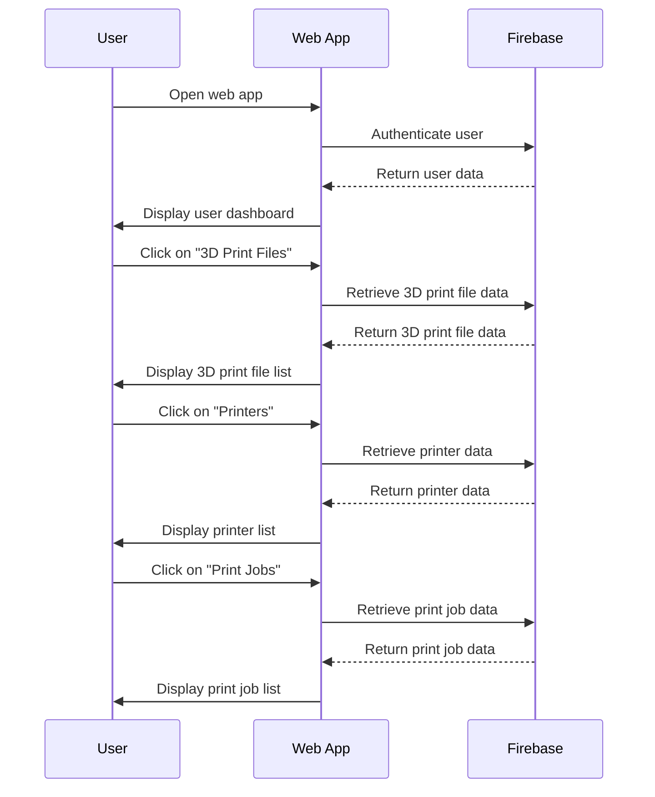

```mermaid
sequenceDiagram
User->>Web App: Open web app
Web App->>Firebase: Authenticate user
Firebase-->>Web App: Return user data
Web App->>User: Display user dashboard
User->>Web App: Click on "3D Print Files"
Web App->>Firebase: Retrieve 3D print file data
Firebase-->>Web App: Return 3D print file data
Web App->>User: Display 3D print file list
User->>Web App: Click on "Printers"
Web App->>Firebase: Retrieve printer data
Firebase-->>Web App: Return printer data
Web App->>User: Display printer list
User->>Web App: Click on "Print Jobs"
Web App->>Firebase: Retrieve print job data
Firebase-->>Web App: Return print job data
Web App->>User: Display print job list

```
