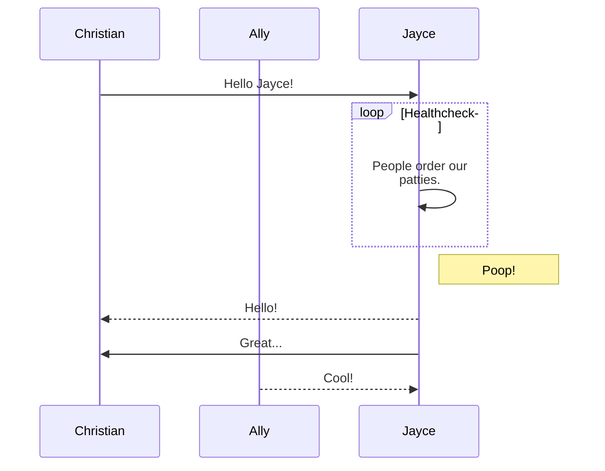
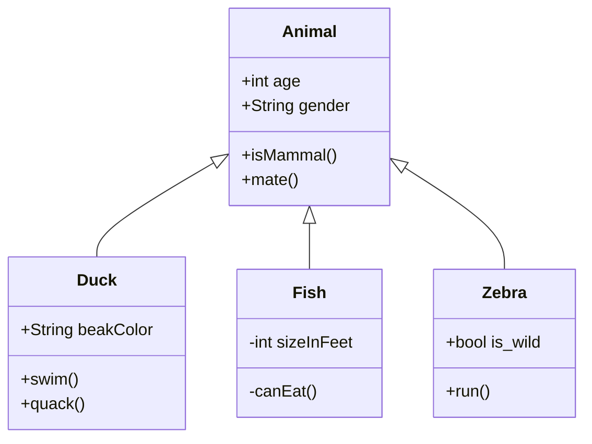
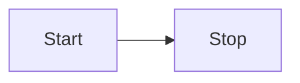
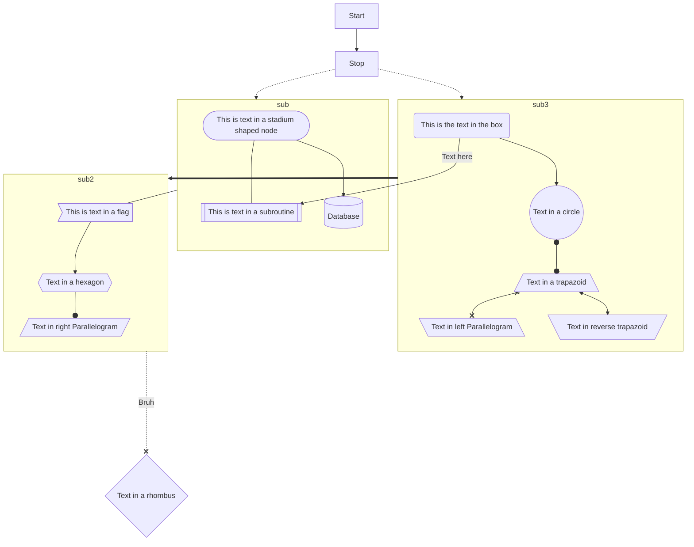
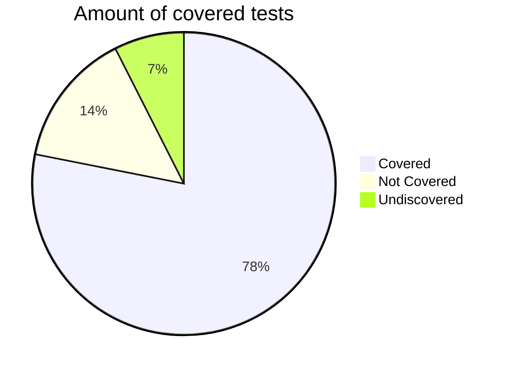
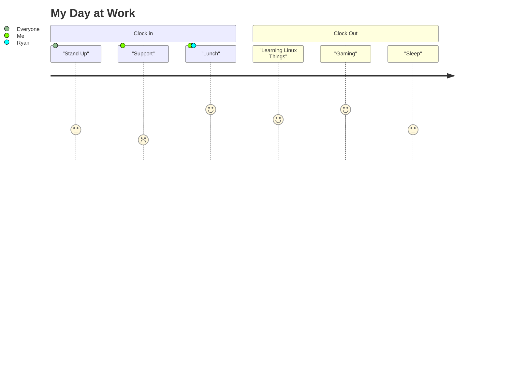
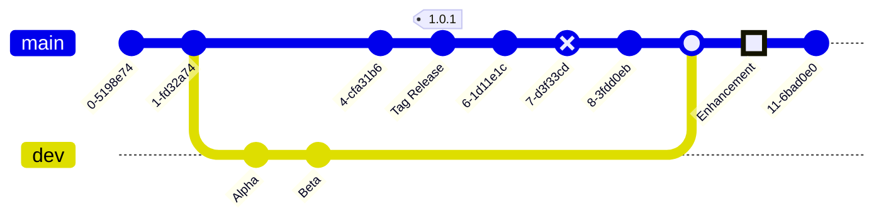

## Sequence Diagram

```mermaid
sequenceDiagram
	participant Christian
	participant Ally
	Christian->>Jayce: Hello Jayce!
	loop Healthcheck
		Jayce->>Jayce: People order our <br/>patties.
	end
	Note right of Jayce: Poop!
	Jayce-->>Christian: Hello!
	Jayce->>Christian: Great...
	Ally-->>Jayce: Cool!	
```
---
## Class Diagram

```mermaid
classDiagram
	Animal<|--Duck
	Animal<|--Fish
	Animal<|--Zebra
	Animal : +int age
	Animal : +String gender
	Animal : +isMammal()
	Animal : +mate()
	class Duck {
		+String beakColor
		+swim()
		+quack()
    }
	class Fish {
		-int sizeInFeet
		-canEat()
	}
	class Zebra {
		+bool is_wild
		+run()
	}
```
---
## Flowchart Left->Right

```mermaid
flowchart LR
	Start --> Stop
```
---
## Flowchart Top->Down

```mermaid
flowchart TD
	id1(This is the text in the box)
	id2([This is text in a stadium shaped node])
	id3[[This is text in a subroutine]]
	id4[(Database)]
	id5((Text in a circle))
	id6>This is text in a flag]
	id7{Text in a rhombus}
	id8{{Text in a hexagon}}
	id9[/Text in right Parallelogram/]
	id10[\Text in left Parallelogram\]
	id11[/Text in a trapazoid\]
	id12[\Text in reverse trapazoid/]
	
	Start --> Stop
	Stop -.-> sub3 & sub
	id1 -->|Text here| id3
	subgraph sub
		direction LR
		id2 --- id3
		id2 --> id4
	end
	subgraph sub3
		id1 --> id5
		id5 o--o id11
		id11 <--> id12
		id11 x--x id10
	end
	sub3 ==> sub2
	sub --- id6
	subgraph sub2
		id6 --> id8
		id8 --o id9
	end
	sub2 -. Bruh ......-x id7
```
---
## Pie Chart

```mermaid
pie title Amount of covered tests
	"Covered" : 78.50
	"Not Covered" : 14.50
	"Undiscovered" : 7.50
```
---
## User Journey

```mermaid
journey
	title My Day at Work
	section Clock in
		"Stand Up": 3: Everyone
		"Support": 2: Me
		"Lunch": 5: Me, Ryan
	section Clock Out
		"Learning Linux Things": 4
		"Gaming": 5
		"Sleep": 3
```
---
## Gitgraph Diagram

```mermaid
gitGraph
	commit
	commit
	branch dev
	commit id: "Alpha"
	commit id: "Beta"
	checkout main
	commit
	commit tag: "1.0.1" id: "Tag Release"
	commit
	commit type: REVERSE
	commit
	merge dev
	commit type: HIGHLIGHT id: "Enhancement"
	commit
```
---